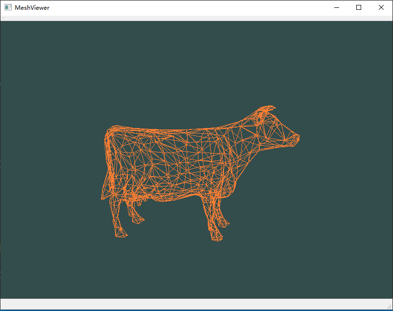

## 介绍
QT和OpenGL做的网格查看器，采用可编程渲染管线, 实现旋转，缩放功能。

目标是把基本的各类网格显示都实现，而且可以做到使用命令行打开。目前实现了三角形网格（obj文件），四边形网格。

## 环境
* VS 2019
* QT 5.12.3

## 展示
三角网格：

## 操作

* 旋转 鼠标拖拽模型
* 缩放 滑动鼠标滚轮
  
## 更新

2020/12/8 congcong

* 实现了三角形网格（obj）查看
* 实现了旋转，缩放功能

2020/12/14 congcong

* 增加四边形网格
* 实现了网格打开时以合适的大小位于中心位置

